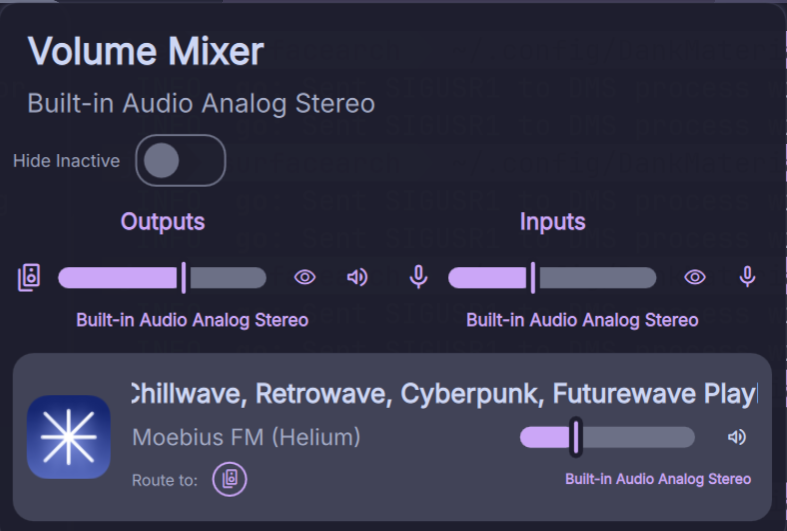

# Volume Mixer Plugin for DankMaterialShell

A modular volume mixer for the DMS bar, providing control over hardware devices and application streams.

> **Note**: This plugin was vibe coded with the help of Gemini CLI.

## Installation

To install this plugin in DankMaterialShell:

1.  Navigate to your DMS plugins directory (usually `~/.config/DankMaterialShell/plugins/`).
2.  Create a new folder named `volumeMixer`.
3.  Copy all the files and folders from this project into that new `volumeMixer` directory.
4.  Restart DMS or reload your shell.
5.  Enable **Volume Mixer** in the DMS Plugin Settings.

---

## Project Structure

This plugin uses a modular architecture to separate logic from UI components.

### Core Files
- **`VolumeMixer.qml`**: The entry point. It handles the layout and manages the bar pill and popout window.
- **`Logic/VolumeLogic.qml`**: The logic controller. It manages internal state (deactivation, routing), handles shell commands (`pactl` and `wpctl`), and manages service connections.
- **`VolumeMixerSettings.qml`**: The plugin settings interface.

### UI Components (`Components/`)
- **`DeviceRow.qml`**: UI for hardware inputs and outputs. Receives a `deviceNode` and `volLogic`.
- **`StreamTile.qml`**: UI for application audio streams. Handles MPRIS metadata mapping and Chromium stream handling.
- **`RoutingStrip.qml`**: A sub-component used within `StreamTile` to route audio between hardware devices.
- **`ScrollingText.qml`**: A utility component that scrolls text if it exceeds the available width.

## Technical Details

### Stream Visibility
This plugin follows a dynamic visibility model. It only displays audio streams that are **currently active** or recently active in Pipewire. When an application stops streaming audio and closes its Pipewire node, it will automatically be removed from the mixer UI.

### Reactivity
The plugin uses a centralized `stateTrigger` in `VolumeLogic` to keep the UI in sync with Pipewire and MPRIS changes.

### Stream Routing
The plugin uses `pactl move-sink-input` where possible to move streams using stable serial identifiers.

### Chromium/Electron Handling
- **Ghost Streams**: Handles temporary streams created by browsers during initialization.
- **MPRIS Conflict**: Detects multiple playback streams from the same application and adjusts metadata display to prevent title duplication.

## For Developers
The modular design allows components to be used independently:
1.  **Logic**: The `Logic/` folder handles Pipewire/pactl interactions.
2.  **UI**: `DeviceRow.qml` or `StreamTile.qml` can be used as building blocks for other audio tools.

---

## Credits
- Inspired by the [dms-volume-mixer](https://github.com/cwelsys/dms-volume-mixer) project by **cwelsys**.

